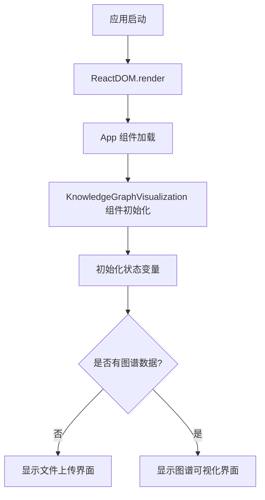
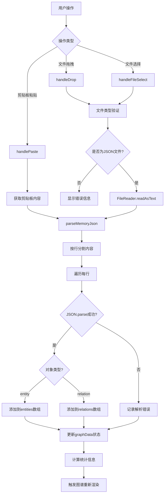
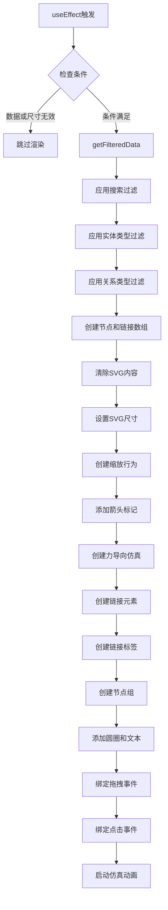
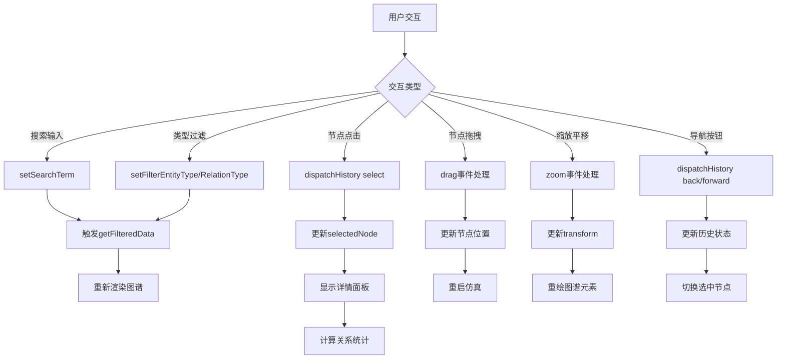
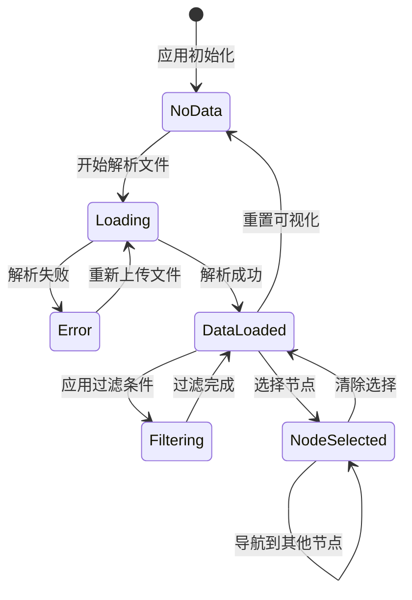

# Anthropic Memory MCP Visualizer - 架构与流程文档

## 项目概述

Anthropic Memory MCP Visualizer 是一个交互式的知识图谱可视化工具，专门用于可视化、调试和分析由 Anthropic Memory MCP 服务器生成的 memory.json 文件中的实体、关系和观察数据。

## 主要功能模块

### 1. 数据解析模块 (Data Parsing)
- **功能**: 解析 memory.json 文件格式
- **支持格式**: 每行一个 JSON 对象（实体或关系）
- **数据类型**: 
  - Entity: `{type: "entity", name, entityType, observations}`
  - Relation: `{type: "relation", from, to, relationType}`
- **错误处理**: 文件格式验证和解析错误提示

### 2. 文件输入模块 (File Input)
- **拖拽上传**: 支持拖拽 JSON 文件到界面
- **文件选择**: 传统文件选择器
- **剪贴板粘贴**: 支持直接粘贴 JSON 内容
- **格式验证**: 自动检测和验证文件格式

### 3. 数据过滤与搜索模块 (Filtering & Search)
- **文本搜索**: 支持按实体名称、类型、观察内容搜索
- **实体类型过滤**: 按实体类型筛选显示
- **关系类型过滤**: 按关系类型筛选显示
- **实时过滤**: 过滤条件变化时实时更新图谱

### 4. 图谱可视化模块 (Graph Visualization)
- **D3.js 力导向图**: 使用 D3.js 实现交互式力导向布局
- **节点渲染**: 实体显示为彩色圆圈，按类型着色
- **边渲染**: 关系显示为带箭头的曲线，包含关系类型标签
- **缩放平移**: 支持鼠标滚轮缩放和拖拽平移
- **节点拖拽**: 支持拖拽节点重新定位

### 5. 交互导航模块 (Navigation)
- **节点选择**: 点击节点查看详细信息
- **历史导航**: 前进/后退按钮浏览选择历史
- **关系导航**: 在详情面板中点击相关实体进行导航
- **中心定位**: 选择节点时自动居中显示

### 6. 详情面板模块 (Details Panel)
- **实体信息**: 显示实体名称、类型、观察列表
- **关系统计**: 显示入站和出站关系数量
- **关系列表**: 分别显示入站和出站关系详情
- **快速导航**: 点击关系中的实体名称快速跳转

### 7. 统计信息模块 (Statistics)
- **实体统计**: 显示实体总数和类型数量
- **关系统计**: 显示关系总数和类型数量
- **实时更新**: 根据过滤条件实时更新统计信息

## 代码执行流程图

### 应用启动流程

### 文件处理流程

### 图谱渲染流程

### 用户交互流程

### 状态管理流程

## 技术栈详解

### 前端框架
- **React 18**: 使用函数组件和 Hooks
- **TypeScript**: 提供类型安全
- **Vite**: 快速开发构建工具

### 可视化库
- **D3.js v7**: 数据驱动的文档操作
- **力导向布局**: 自动计算节点位置
- **SVG渲染**: 矢量图形确保缩放质量

### 样式框架
- **TailwindCSS**: 实用优先的CSS框架
- **响应式设计**: 支持不同屏幕尺寸

### 状态管理
- **useState**: 组件本地状态
- **useReducer**: 复杂状态逻辑（历史导航）
- **useRef**: DOM引用和D3集成

## 性能优化策略

1. **按需渲染**: 只在数据或过滤条件变化时重新渲染
2. **虚拟化**: 大数据集时的性能优化
3. **防抖处理**: 搜索输入的防抖优化
4. **内存管理**: 及时清理D3事件监听器
5. **懒加载**: 详情面板按需计算关系统计

## 扩展性设计

- **模块化组件**: 易于添加新的可视化类型
- **插件架构**: 支持自定义过滤器和渲染器
- **主题系统**: 可配置的颜色和样式
- **导出功能**: 支持导出图谱为图片或数据